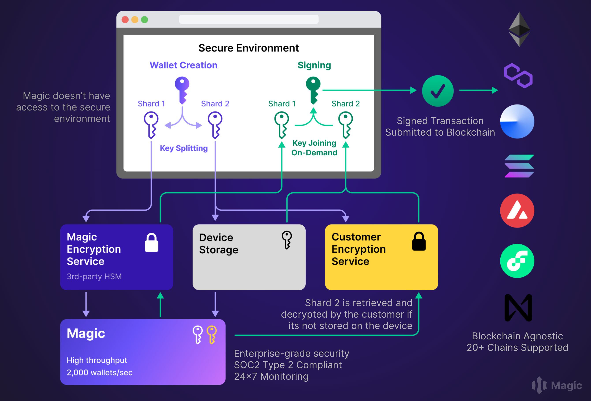

# Split KMS Customer Encryption API

Magic offers non-custodial Wallet-as-a-Service, allowing web or mobile
application developers to seamlessly integrate web3 wallets into their apps with
a familiar web2 user experience. The cornerstone of Magic’s offering is its
patented [Delegated Key Management System
(DKMS)](https://magic.link/docs/home/security/product-security#hardware-security-modules-hs-ms).

This repository introduces a novel shared security model where Magic’s
developers can deploy a cloud-native, elastic infrastructure to encrypt segments
of the private key, divided into multiple shares using the tested and proven
[Shamir's Secret Sharing
algorithm](https://web.mit.edu/6.857/OldStuff/Fall03/ref/Shamir-HowToShareASecret.pdf).
You can learn more about this wallet key management model in Magic’s [developer
documentation](https://magic.link/docs/split-kms).



## Getting started

Below outlines the expected workflow for developers participating in the Modular KMS offering:

1. Opt-in for Modular KMS when opening your developer account with Magic. Note
that this feature is currently in invite-only mode; therefore, please [contact
sales](https://magic.link/contact) to enable this functionality.
2. Customers using Magic’s Modular KMS need to encrypt device hydration private
key shares. To do so, fork this repository, make any modifications (if
necessary), and deploy it to your AWS account. The encryption API tech stack is
optimized for AWS Serverless Architecture, ensuring easy scalability.
3. Register the API endpoints with Magic to receive callbacks for encryption and
decryption at runtime when users create a wallet and perform signing
transactions.

## Requirements

Sign up for a cloud vendor; currently, we support Amazon Web Services (AWS).

## License

We have open-sourced this repository under the Apache 2.0 license, making it
suitable for modification to fit the unique requirements of your production
environment. [View the license](./LICENSE).

## Maintenance and Support for Versions

Currently we support AWS as the default cloud providers, we are looking to
integrate this offering with other cloud providers such as Google Cloud and
Microsoft Azure

## Installation

We use AWS CDK for this repository. The following commands will help you deploy
the CDK to your AWS account.

```bash
make install
make synth
make diff
make deploy
```

## Configuration

The reference implementation of the CDK comes with a bring-your-own KMS model
for encrypting and decrypting your share of the key. You are welcome to
customize the configuration further to suit your needs, such as using an
external HSM in place of AWS KMS.

## Getting Help

Reach out to Magic customer support for assistance.


## Documentation

- [AWS CDK API v2 Documentation](https://docs.aws.amazon.com/cdk/api/v2/)
